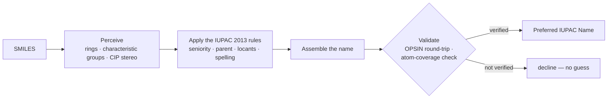

<div align="center">

<a id="top"></a>
<picture>
  <source media="(prefers-color-scheme: dark)" srcset="assets/orthonym-logo-dark.png">
  
</picture>

### Structure in. The one correct IUPAC name out.
*A deterministic, rule-based engine that turns a SMILES string into its Preferred IUPAC Name.*

<br/>

[](LICENSE)
[](https://www.python.org/)
[](https://doi.org/10.1039/9781849733069)
[](https://www.rdkit.org/)
[](https://github.com/dan2097/opsin)
[](https://openjdk.org/)

[](https://github.com/Beilstein-Institut/Orthonym/actions/workflows/ci.yml)
[](#-how-it-works)
[](CITATION.cff)

[Quick Start](#-quick-start) ·
[Install](#-installation) ·
[How it works](#-how-it-works) ·
[Citing](#-citing-orthonym) ·
[Contributing](CONTRIBUTING.md)

</div>

---

## ✨ What is Orthonym?

**Orthonym** reads a molecule's structure and writes its name — the **Preferred IUPAC Name (PIN)**
defined by the IUPAC 2013 recommendations, the "Blue Book". It is the structure → name
counterpart of [OPSIN](https://github.com/dan2097/opsin), which goes name → structure.

Every name is **built from the nomenclature rules**, not looked up and not predicted by a model.
In the default tier, every name is parsed back with OPSIN and checked against the input structure
before it leaves the engine. When Orthonym cannot produce a name it can verify, it **declines instead of guessing**:
a clear "I don't know" is safer than a confident wrong name.

```python
>>> from orthonym import name_compound
>>> name_compound("CC(C)Cc1ccc(cc1)[C@@H](C)C(=O)O")
'(2R)-2-[4-(2-methylpropyl)phenyl]propanoic acid'
```

## 🔬 Features

- 🎯 **PIN-first** — targets the Preferred IUPAC Name of the 2013 recommendations, not just *a* valid name
- 🔁 **Deterministic** — the same structure always gives the same name; no model, no training data, no randomness
- ✅ **Round-trip validated** — in the default tier, every name is parsed back with OPSIN and compared to the input structure
- 🛑 **Declines rather than guesses** — a name that cannot be verified is not returned
- 🧬 **Broad organic chemistry** — chains, rings, Hantzsch–Widman heterocycles, fused, bridged (von Baeyer) and spiro systems, and the characteristic-group families (acids, esters, amides, amines, nitriles, …)
- 🌀 **Stereochemistry** — R/S and E/Z descriptors from a high-accuracy CIP labeller
- 🧾 **Provenance on request** — the tier, the validation outcome and the source of every name
- 🧰 **Python API and CLI** — one call for one molecule, batch mode for files

## 🚀 Quick Start

```bash
pip install "git+https://github.com/Beilstein-Institut/Orthonym.git"
orthonym --fetch-jars          # one-time: downloads and checks the OPSIN and centres jars
```

```python
from orthonym import name_compound

name_compound("CCO")                          # 'ethanol'
name_compound("CC(=O)Oc1ccccc1C(=O)O")        # '2-(acetyloxy)benzoic acid'
name_compound("Cn1cnc2c1c(=O)n(C)c(=O)n2C")   # '1,3,7-trimethyl-3,7-dihydro-1H-purine-2,6-dione'
name_compound("C/C=C/C")                      # '(2E)-but-2-ene'
name_compound("C[C@H](O)CC")                  # '(2S)-butan-2-ol'
```

From the command line:

```bash
orthonym "CCO"                                # ethanol
orthonym "CC(=O)Oc1ccccc1C(=O)O" --provenance # the name plus tier, validation and source, as JSON
orthonym --batch molecules.smi -o names.txt   # one SMILES per line
python -m orthonym "c1ccccc1"                 # module form
```

## 📦 Installation

### Requirements

| Requirement | Why |
|---|---|
| **Python 3.10+** | the engine |
| **Java runtime 11+** on your `PATH` | OPSIN round-trip validation and the CIP labeller run on the JVM |

### From GitHub

```bash
pip install "git+https://github.com/Beilstein-Institut/Orthonym.git"
```

### From a clone (for development)

```bash
git clone https://github.com/Beilstein-Institut/Orthonym.git
cd Orthonym
python -m venv .venv && source .venv/bin/activate
pip install -e ".[dev]"
```

### The OPSIN and centres jars

Orthonym does **not** ship any Java jars. It uses two, and downloads them from their official
releases, checking each against a pinned SHA-256 checksum:

| Jar | Version | Used for | Licence |
|---|---|---|---|
| [OPSIN](https://github.com/dan2097/opsin) `opsin-cli-2.9.0-jar-with-dependencies.jar` | 2.9.0 | round-trip validation of every name | MIT (the jar bundles jna-inchi, LGPL-2.1, and others) |
| [centres](https://github.com/SiMolecule/centres) `centres.jar` | 1.2.1 | CIP stereo descriptors (R/S, E/Z) | BSD-2-Clause (the jar bundles CDK, LGPL-2.1+) |

`pip install` tries to fetch them for you. To fetch or re-check them at any time:

```bash
orthonym --fetch-jars
```

If a jar is missing, Orthonym **stops with a clear error** rather than quietly naming with less
validation. For offline machines, point Orthonym at jars you copied yourself:

| Setting | Effect |
|---|---|
| `ORTHONYM_OPSIN_JAR=/path/to/opsin-cli-2.9.0-jar-with-dependencies.jar` | use this OPSIN jar |
| `ORTHONYM_CENTRES_JAR=/path/to/centres-cli-1.2.1.jar` | use this centres jar |
| `ORTHONYM_JAR_DIR=/path/to/dir` | where downloaded jars are kept (default: your user cache) |

Licences and sources of the third-party components are listed in [`NOTICE`](NOTICE).

## 🧭 How it works



1. **Perceive.** RDKit reads the structure; Orthonym finds rings, characteristic groups and stereocentres.
2. **Apply the rules.** Seniority, the parent hydride, locants, alphanumerical order and spelling
   follow the Blue Book, built as whole nomenclature classes rather than per-molecule special cases.
3. **Validate.** The candidate name is parsed back with OPSIN and compared to the input structure,
   and an atom-coverage check confirms that every atom is accounted for.
4. **Emit or decline.** A verified name is returned. Otherwise Orthonym degrades to a
   less-preferred but still correct systematic name, or declines.

### Output tiers

The default is strict. Wider tiers are opt-in with `--emit-tier`:

| Tier | Returns |
|---|---|
| `pin` *(default)* | the Preferred IUPAC Name, or nothing |
| `valid` | adds round-trip-verified general names |
| `complete` | adds round-trip-verified names from the wider general fallbacks (non-PIN allowed) |
| `best-effort` | adds names that pass the atom-coverage check but are not verified by OPSIN |

## 📐 How accuracy is measured

Orthonym is judged by what it gets **exactly right** and by what it gets **wrong**:

- **Round-trip exact match** — name the structure, parse the name with OPSIN, and compare the full
  InChIKey with the input's. Every molecule counts; a declined molecule counts as a miss.
- **Wrong structures** — any emitted name that parses to a different molecule. The design target is zero.
- **Preferred-name conformance** — names checked character-for-character against molecules the
  Blue Book itself marks as the preferred name.

Benchmark results will be published with the accompanying paper.

## 🛠️ Development

Run the tests on targeted file sets (the OPSIN-backed tests need a Java runtime and the jars):

```bash
python -m pytest tests/unit/assembly -q
python -m pytest tests/unit/rules/test_multiplicative.py -q
```

Test markers (`unit`, `integration`, `roundtrip`, `slow`, `benchmark`) are defined in `pyproject.toml`.

```
Orthonym/
├── src/orthonym/
│   ├── perception/   # structure perception: rings, characteristic groups, CIP stereo
│   ├── rules/        # IUPAC nomenclature rules
│   ├── assembly/     # name assembly: locants, ordering, selection
│   ├── validation/   # OPSIN round-trip and atom-coverage checks
│   └── data/         # naming tables
└── tests/            # unit and integration tests
```

## 📚 Documentation

| Doc | Purpose |
|---|---|
| [`CONTRIBUTING.md`](CONTRIBUTING.md) | Development setup, tests, and how to add a compound class |
| [`CHANGELOG.md`](CHANGELOG.md) | Release notes |
| [`NOTICE`](NOTICE) | Third-party components and their licences |
| [`SECURITY.md`](SECURITY.md) | How to report a vulnerability |
| [`CODE_OF_CONDUCT.md`](CODE_OF_CONDUCT.md) | Community standards |
| [`CITATION.cff`](CITATION.cff) | Citation metadata |

## 🤝 Contributing

Contributions are welcome. Please read [`CONTRIBUTING.md`](CONTRIBUTING.md) first.

1. [Fork](https://docs.github.com/en/pull-requests/collaborating-with-pull-requests/working-with-forks/fork-a-repo) the repository
2. Create a feature branch off `main`
3. Add a test that pins the expected name, citing the governing IUPAC rule
4. Open a [pull request](https://docs.github.com/en/pull-requests/collaborating-with-pull-requests/proposing-changes-to-your-work-with-pull-requests/creating-a-pull-request)

## 📖 Citing Orthonym

If you use Orthonym in published work, please cite it using the metadata in
[`CITATION.cff`](CITATION.cff), or the BibTeX entry below:

```bibtex
@software{orthonym,
  author  = {Rajan, Kohulan and Zielesny, Achim and Steinbeck, Christoph},
  title   = {{Orthonym}},
  version = {1.0.0},
  year    = {2026},
  url     = {https://github.com/Beilstein-Institut/Orthonym}
}
```

## 📜 License

Orthonym is released under the **[MIT License](LICENSE)**. The OPSIN and centres jars are not part
of this repository; they are downloaded from their official releases and keep their own licences
(see [`NOTICE`](NOTICE)).

## 🙏 Acknowledgments

Orthonym stands on the IUPAC 2013 recommendations and on open cheminformatics software:

> Favre, H. A.; Powell, W. H. *Nomenclature of Organic Chemistry: IUPAC Recommendations and
> Preferred Names 2013*. Royal Society of Chemistry, **2013**.
> [doi:10.1039/9781849733069](https://doi.org/10.1039/9781849733069)
>
> Lowe, D. M.; Corbett, P. T.; Murray-Rust, P.; Glen, R. C. Chemical Name to Structure: OPSIN,
> an Open Source Solution. *J. Chem. Inf. Model.* **2011**, 51 (3), 739–753.
> [doi:10.1021/ci100384d](https://doi.org/10.1021/ci100384d)
>
> Hanson, R. M.; Musacchio, S.; Mayfield, J. W.; Vainio, M. J.; Yerin, A.; Redkin, D. Algorithmic
> Analysis of Cahn–Ingold–Prelog Rules of Stereochemistry: Proposals for Revised Rules and a Guide
> for Machine Implementation. *J. Chem. Inf. Model.* **2018**, 58 (9), 1755–1765.
> [doi:10.1021/acs.jcim.8b00324](https://doi.org/10.1021/acs.jcim.8b00324)

[RDKit](https://www.rdkit.org/) handles molecular perception, and
[centres](https://github.com/SiMolecule/centres) assigns CIP descriptors.

## 💬 Feedback

Open a [GitHub issue](https://github.com/Beilstein-Institut/Orthonym/issues/new/choose).

<div align="center">

---

Made with ☕ by [Kohulan Rajan](https://www.kohulanr.com/) at the
[Beilstein-Institut](https://www.beilstein-institut.de/en/), in collaboration with the
[Steinbeck Lab](https://cheminf.uni-jena.de/)

[Back to top ↑](#top)

</div>
