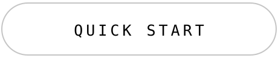
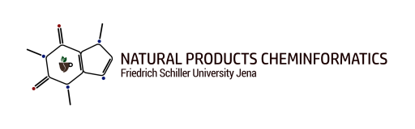
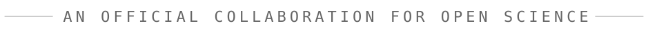

<div align="center">

<picture>
  <source media="(max-width: 700px)" srcset="assets/readme-banner-narrow.svg">
  
</picture>

<br>

<a href="https://orthonym.decimer.ai"></a>&nbsp;&nbsp;<a href="#quick-start"></a>

<br>

**A SMILES string goes in. A verified IUPAC name comes out, or a clear "no". Never a guess.**

[](LICENSE)
[](https://www.python.org/)
[](https://doi.org/10.1039/9781849733069)
[](https://github.com/Steinbeck-Lab/Orthonym/actions/workflows/ci.yml)
[](https://steinbeck-lab.github.io/Orthonym/)
[](https://doi.org/10.5281/zenodo.23044199)
[](https://github.com/Steinbeck-Lab/Orthonym-Web)
[](https://github.com/Kohulan/orthonym-skills)

<sub>Part of the Orthonym project: <a href="https://github.com/Kohulan/orthonym-skills"><b>orthonym-skills</b></a>, the Claude Code skills that Orthonym was built with (<a href="#how-orthonym-was-built">how</a>).</sub>

</div>

## How names are checked

<picture>
  <source media="(max-width: 700px)" srcset="assets/readme-roundtrip-narrow.svg">
  
</picture>

**Deterministic.** Orthonym builds its names from the nomenclature rules of the IUPAC 2013
recommendations, the "Blue Book". Where those rules do not yet reach a molecule, a wider tier
(`--emit-tier`) can give a general systematic name, a retained name from a table or a
natural-product name instead, labelled as not the preferred name. The default tier declines these
names; [Output tiers](#output-tiers) lists its exceptions. There is no neural network and no
sampling: the same input always gives the same output.

**Checked.** A name is handed to [OPSIN](https://github.com/dan2097/opsin), which never saw your
structure, and parsed back. The structure OPSIN reads must match yours in constitution, charge and
stereo, so a name that leaves out or adds an atom cannot pass. The default tier makes a few
exceptions for names OPSIN cannot read in full: names from exact-match lists (metal-complex and
natural-product parent names), a few name forms that OPSIN's grammar lacks or misreads, and names
whose stereodescriptors OPSIN cannot parse (OPSIN confirms their constitution, and each descriptor is
checked against its CIP label). `--provenance` marks each of them. The wider tiers ship none of
them, except the names from the exact-match lists: a metal-complex name, and a natural-product
parent name when no verified systematic name is found.

**Honest.** A candidate that fails a check is withdrawn, and when no name is left Orthonym says so
instead of guessing. `--provenance` reports the tier each name landed on and, in its `verified`
field, how it was checked.

## See it working

<picture>
  <source media="(max-width: 700px)" srcset="assets/readme-specimen-narrow.svg">
  
</picture>

<sub>Real output. The command line prints the plain line; the mark under it and the tier at its right
come from the same command run with <code>--provenance</code>. The pictures are generated from the
engine's own output, so they show what it prints.</sub>

The same from Python:

```python
>>> from orthonym import name_compound
>>> name_compound("CC(C)Cc1ccc(cc1)[C@@H](C)C(=O)O")
'(2R)-2-[4-(2-methylpropyl)phenyl]propanoic acid'
```

## Quick start

Needs Python 3.10+ and a Java 11+ runtime on your `PATH` (see [Installation](#installation)).

```bash
pip install "git+https://github.com/Steinbeck-Lab/Orthonym.git"
orthonym --fetch-jars          # one-time: downloads and checks the OPSIN and centres jars
```

```python
from orthonym import name_compound

name_compound("CCO")                          # 'ethanol'
name_compound("CC(=O)Oc1ccccc1C(=O)O")        # '2-(acetyloxy)benzoic acid'
name_compound("Cn1cnc2c1c(=O)n(C)c(=O)n2C")   # '1,3,7-trimethyl-3,7-dihydro-1H-purine-2,6-dione'
name_compound("C/C=C/C")                      # '(2E)-but-2-ene'
name_compound("C[C@H](O)CC")                  # '(2S)-butan-2-ol'
```

`name_compound` and the other naming functions also take an RDKit `Chem.Mol` in place of the SMILES string, for example a molecule read from an SDF file. The Mol is named through RDKit's SMILES of it (`Chem.MolToSmiles(mol)`), after a check that this SMILES holds the same molecule and stereo; when it does not, the call raises `ValueError`. Your Mol is not changed.

From the command line:

```bash
orthonym "CCO"                                # ethanol
orthonym "CC(=O)Oc1ccccc1C(=O)O" --provenance # the name plus tier, validation and source, as JSON
orthonym --batch molecules.smi -o names.txt   # one SMILES per line
python -m orthonym "c1ccccc1"                 # module form
```

## Installation

| Requirement | Why |
|:--|:--|
| **Python 3.10+** | the engine |
| **Java runtime 11+** on your `PATH` | OPSIN round-trip validation and the CIP labeller are Java programs |

Install from GitHub as in [Quick start](#quick-start). For a development install from a clone,
see [`CONTRIBUTING.md`](CONTRIBUTING.md).

### The OPSIN and centres jars

Orthonym does **not** ship any Java jars. It uses two, and downloads them from their official
releases, checking each download against a pinned SHA-256 checksum:

| Jar | Version | Used for | Licence |
|:--|:--|:--|:--|
| [OPSIN](https://github.com/dan2097/opsin) `opsin-cli-2.9.0-jar-with-dependencies.jar` | 2.9.0 | round-trip validation of names | MIT (the jar bundles jna-inchi, LGPL-2.1, and others) |
| [centres](https://github.com/SiMolecule/centres) `centres-cli-1.2.1.jar` (published as `centres.jar`) | 1.2.1 | CIP stereo descriptors (R/S, E/Z) | BSD-2-Clause (the jar bundles CDK, LGPL-2.1+) |

`pip install` tries to fetch them for you, and a jar that is still missing is downloaded and
checked the first time Orthonym needs it. To fetch them, or re-check the ones in the jar directory,
run `orthonym --fetch-jars`. If a jar cannot be found or downloaded (or `ORTHONYM_NO_DOWNLOAD=1`
forbids the download), Orthonym **stops with a clear error** rather than quietly naming with less
validation; without a working Java runtime it declines every molecule rather than naming it
unchecked. For offline machines, point Orthonym at jars you copied yourself (a jar given this way
is used as given, without the checksum check):

| Setting | Effect |
|:--|:--|
| `ORTHONYM_OPSIN_JAR=/path/to/opsin-cli-2.9.0-jar-with-dependencies.jar` | use this OPSIN jar |
| `ORTHONYM_CENTRES_JAR=/path/to/centres-cli-1.2.1.jar` | use this centres jar |
| `ORTHONYM_JAR_DIR=/path/to/dir` | where downloaded jars are kept (default: your user cache) |

Licences and sources of the third-party components are listed in [`NOTICE`](NOTICE).

## Output tiers

The default returns a name only when the strict PIN path built it and verified it, or when the name
is one of the few exceptions: a name from the exact-match lists, a name format absent from OPSIN's
grammar, or a PIN whose stereodescriptors OPSIN cannot read. With `--trivial` it also returns a
retained trivial name, labelled `systematic_verified`. Otherwise it declines. This rule applies to
the default `--style pin`. Wider tiers are opt-in with `--emit-tier`:

| `--emit-tier` | Returns |
|:--|:--|
| `pin` *(default)* | a name only when the strict PIN path built it and verified it, or a name from the exact-match lists, a name format absent from OPSIN's grammar or a PIN whose stereodescriptors OPSIN cannot read (with `--trivial`, also a retained trivial name); otherwise nothing (`NO_VERIFIED_PIN`) |
| `valid` | also general names that OPSIN reads back to your structure |
| `complete` | also general names for aromatic and heterocyclic ring systems |
| `best-effort` | also the names of the last-resort producers, von Baeyer and spiro names for ring systems of up to 100 skeletal atoms and 11 rings (the other tiers build these names for ring systems of up to 40 skeletal atoms and 8 rings), and adducts with a one-atom ion such as chloride |

At `valid`, `complete` and `best-effort` every name must pass a full-InChIKey OPSIN round trip (a
name from the natural-product and metal-complex lists excepted), so the name formats absent from
OPSIN's grammar, which the default tier ships without a full read-back, are not shipped there, and
a wider tier can, rarely, decline a molecule that a narrower tier names.

Whatever the tier, `--provenance` (one SMILES at a time) says what each name is: `pin_verified`
(the strict PIN path built it and verified it), `pin_unverified` (a name in PIN form whose
preferred status is not certified), `systematic_verified` (a correct systematic name that is not
the PIN, for example from the general engine, from a table of retained names, a strict-path name
with a part the engine records as not the preferred form, a natural-product name of a molecule
whose bridged fused PIN the engine does not build yet, or of a class for which the Blue Book
gives no PIN, such as Group 1-12 organometallic compounds), `best_effort` (a last-resort producer's
name, or one that no round trip confirmed) or `abstain` (no name). The tier says how a name was
built.
The `verified` field says how it was checked: `opsin` (OPSIN read the whole name back to your
structure), `opsin_constitution` (OPSIN read it back without its stereodescriptors, and each
descriptor was checked against its CIP label), `identity` (a name from an exact-match list: a
metal-complex name found by your structure's exact InChIKey, or a natural-product parent name found
by its exact structure; OPSIN cannot read these names) or `unverified`.

When Orthonym cannot name a molecule, the plain call returns a label in place of a name, such as
`inorganic compound (not supported)`, and `--provenance` marks the row `abstain` with a reason code.
[More on declines](guide/declines.md).

## More

- [How it works](guide/how-it-works.md): the four parts of the engine and the source layout.
- [Declines](guide/declines.md): what a "no" looks like, and how to tell one from a name in code.
- [How accuracy is measured](guide/accuracy.md): the three measures the engine is judged by.
- [Contributing](CONTRIBUTING.md): development install, tests, source layout, how to add a compound class.
- [orthonym-skills](https://github.com/Kohulan/orthonym-skills): the Claude Code skills, hooks and agent Orthonym was built with.
- [Changelog](CHANGELOG.md) · [Security](SECURITY.md) · [Code of conduct](CODE_OF_CONDUCT.md) ·
  [Open an issue](https://github.com/Steinbeck-Lab/Orthonym/issues/new/choose)

## How Orthonym was built

Orthonym was built with [Claude Code](https://docs.claude.com/en/docs/claude-code), under a fixed
set of working rules. The rules are published as
[**orthonym-skills**](https://github.com/Kohulan/orthonym-skills), part of the Orthonym project:
20 skills, 2 hooks and 1 agent. Each one makes a step rest on a measurement instead of a confident
guess:

- Measure on fixed, hashed test sets before and after each change
  (`run-eval`, `cluster-failures`, `refusal-census`).
- Prove that the code to change is on the execution path before editing it
  (`spy-site`, `check-target`).
- Change an expected value in a test only with a primary source, an independent check and a
  mutation test (`change-asserted-value`, `verify-source`).
- Run the regression gate before a merge (`run-gate`), and get a review from a second model
  before a claim ships (`fable-review`).
- Hand the work from one session to the next through a written note (`handoff`, `kickoff`).

The skills were written for Orthonym and then made general, so that other chemistry and machine
learning software projects can use them.

## How to cite

A paper describing Orthonym is in preparation. Until it is published, please cite the software:
GitHub's **Cite this repository** button, built from [`CITATION.cff`](CITATION.cff), gives the
entry in APA and BibTeX. In BibTeX:

<!-- x-release-please-start-version -->
```bibtex
@software{orthonym,
  author  = {Rajan, Kohulan and Zielesny, Achim and Steinbeck, Christoph},
  title   = {{Orthonym}},
  version = {1.0.5},
  year    = {2026},
  doi     = {10.5281/zenodo.23044199},
  url     = {https://github.com/Steinbeck-Lab/Orthonym}
}
```
<!-- x-release-please-end -->

Every release is archived on Zenodo. The DOI [10.5281/zenodo.23044199](https://doi.org/10.5281/zenodo.23044199)
stands for all versions and resolves to the newest one.

## Built on

Orthonym stands on the IUPAC 2013 recommendations and on open cheminformatics software:
[RDKit](https://www.rdkit.org/) reads the structure, [OPSIN 2.9.0](https://github.com/dan2097/opsin)
reads the names back to check them, and [centres 1.2.1](https://github.com/SiMolecule/centres)
assigns the CIP descriptors. Without them there would be no Orthonym.

> Favre, H. A.; Powell, W. H. *Nomenclature of Organic Chemistry: IUPAC Recommendations and
> Preferred Names 2013*. Royal Society of Chemistry, **2013**.
> [doi:10.1039/9781849733069](https://doi.org/10.1039/9781849733069)
>
> Lowe, D. M.; Corbett, P. T.; Murray-Rust, P.; Glen, R. C. Chemical Name to Structure: OPSIN,
> an Open Source Solution. *J. Chem. Inf. Model.* **2011**, 51 (3), 739–753.
> [doi:10.1021/ci100384d](https://doi.org/10.1021/ci100384d)
>
> Hanson, R. M.; Musacchio, S.; Mayfield, J. W.; Vainio, M. J.; Yerin, A.; Redkin, D. Algorithmic
> Analysis of Cahn–Ingold–Prelog Rules of Stereochemistry: Proposals for Revised Rules and a Guide
> for Machine Implementation. *J. Chem. Inf. Model.* **2018**, 58 (9), 1755–1765.
> [doi:10.1021/acs.jcim.8b00324](https://doi.org/10.1021/acs.jcim.8b00324)

## Licence

MIT, see [LICENSE](LICENSE). The OPSIN and centres jars are not part of this repository; they are
downloaded from their official releases and keep their own licences (see [`NOTICE`](NOTICE)).

<div align="center">
<br>
<sub>Made with  by <a href="https://www.kohulanr.com/">Kohulan Rajan</a> at</sub>
<br><br>
<a href="https://www.beilstein-institut.de/en/"></a>

<a href="https://cheminf.uni-jena.de"></a>
<br><br>
<picture>
  <source media="(max-width: 700px) and (prefers-color-scheme: dark)" srcset="assets/readme-collab-line-narrow-dark.svg">
  <source media="(max-width: 700px)" srcset="assets/readme-collab-line-narrow.svg">
  <source media="(prefers-color-scheme: dark)" srcset="assets/readme-collab-line-dark.svg">
  
</picture>
</div>
