<div align="center">

<picture>
  <source media="(max-width: 700px)" srcset="assets/readme-banner-narrow.svg">
  
</picture>

<br>

<a href="https://orthonym.decimer.ai"></a>&nbsp;&nbsp;<a href="#quick-start"></a>

<br>

**A SMILES string goes in. Its Preferred IUPAC Name comes out, or a clear "no". Never a guess.**

[](LICENSE)
[](https://www.python.org/)
[](https://doi.org/10.1039/9781849733069)
[](https://github.com/Steinbeck-Lab/Orthonym/actions/workflows/ci.yml)
[](https://steinbeck-lab.github.io/Orthonym/)
[](https://github.com/Steinbeck-Lab/Orthonym-Web)

</div>

## How every name is checked

<picture>
  <source media="(max-width: 700px)" srcset="assets/readme-roundtrip-narrow.svg">
  
</picture>

**Deterministic.** Orthonym builds every name from the nomenclature rules of the IUPAC 2013
recommendations, the "Blue Book". There is no neural network and no sampling: the same structure
always gets the same name.

**Checked.** In the default tier, every name is handed to [OPSIN](https://github.com/dan2097/opsin),
which never saw your structure, and parsed back. The two structures are compared by full InChIKey,
and an atom-coverage check confirms that every atom is named.

**Honest.** When no name passes, Orthonym says so instead of guessing. `--provenance` reports the
tier each name landed on and, in its own field, whether OPSIN read it back.

## See it working

<picture>
  <source media="(max-width: 700px)" srcset="assets/readme-specimen-narrow.svg">
  
</picture>

<sub>Real output. The command line prints the plain line; the mark under it and the tier at its right
come from the same command run with <code>--provenance</code>. The pictures are generated from the
engine's own output, so they show what it prints.</sub>

The same from Python:

```python
>>> from orthonym import name_compound
>>> name_compound("CC(C)Cc1ccc(cc1)[C@@H](C)C(=O)O")
'(2R)-2-[4-(2-methylpropyl)phenyl]propanoic acid'
```

## Quick start

Needs Python 3.10+ and a Java 11+ runtime on your `PATH` (see [Installation](#installation)).

```bash
pip install "git+https://github.com/Steinbeck-Lab/Orthonym.git"
orthonym --fetch-jars          # one-time: downloads and checks the OPSIN and centres jars
```

```python
from orthonym import name_compound

name_compound("CCO")                          # 'ethanol'
name_compound("CC(=O)Oc1ccccc1C(=O)O")        # '2-(acetyloxy)benzoic acid'
name_compound("Cn1cnc2c1c(=O)n(C)c(=O)n2C")   # '1,3,7-trimethyl-3,7-dihydro-1H-purine-2,6-dione'
name_compound("C/C=C/C")                      # '(2E)-but-2-ene'
name_compound("C[C@H](O)CC")                  # '(2S)-butan-2-ol'
```

From the command line:

```bash
orthonym "CCO"                                # ethanol
orthonym "CC(=O)Oc1ccccc1C(=O)O" --provenance # the name plus tier, validation and source, as JSON
orthonym --batch molecules.smi -o names.txt   # one SMILES per line
python -m orthonym "c1ccccc1"                 # module form
```

## Installation

| Requirement | Why |
|:--|:--|
| **Python 3.10+** | the engine |
| **Java runtime 11+** on your `PATH` | OPSIN round-trip validation and the CIP labeller are Java programs |

Install from GitHub as in [Quick start](#quick-start). For a development install from a clone,
see [`CONTRIBUTING.md`](CONTRIBUTING.md).

### The OPSIN and centres jars

Orthonym does **not** ship any Java jars. It uses two, and downloads them from their official
releases, checking each against a pinned SHA-256 checksum:

| Jar | Version | Used for | Licence |
|:--|:--|:--|:--|
| [OPSIN](https://github.com/dan2097/opsin) `opsin-cli-2.9.0-jar-with-dependencies.jar` | 2.9.0 | round-trip validation of every name | MIT (the jar bundles jna-inchi, LGPL-2.1, and others) |
| [centres](https://github.com/SiMolecule/centres) `centres.jar` | 1.2.1 | CIP stereo descriptors (R/S, E/Z) | BSD-2-Clause (the jar bundles CDK, LGPL-2.1+) |

`pip install` tries to fetch them for you. To fetch or re-check them at any time, run
`orthonym --fetch-jars`. If a jar is missing, Orthonym **stops with a clear error** rather than
quietly naming with less validation. For offline machines, point Orthonym at jars you copied
yourself:

| Setting | Effect |
|:--|:--|
| `ORTHONYM_OPSIN_JAR=/path/to/opsin-cli-2.9.0-jar-with-dependencies.jar` | use this OPSIN jar |
| `ORTHONYM_CENTRES_JAR=/path/to/centres-cli-1.2.1.jar` | use this centres jar |
| `ORTHONYM_JAR_DIR=/path/to/dir` | where downloaded jars are kept (default: your user cache) |

Licences and sources of the third-party components are listed in [`NOTICE`](NOTICE).

## Output tiers

The default is strict. Wider tiers are opt-in with `--emit-tier`:

| `--emit-tier` | Returns |
|:--|:--|
| `pin` *(default)* | the Preferred IUPAC Name, or nothing |
| `valid` | adds round-trip-verified general names |
| `complete` | adds round-trip-verified names from the wider general fallbacks (non-PIN allowed) |
| `best-effort` | adds names that pass the atom-coverage check but are not verified by OPSIN |

Whatever the tier, `--provenance` says what each name is: `pin_verified` (the strict PIN path built
and verified it), `pin_unverified` (a PIN-form name whose preferred status is not certified),
`systematic_verified` (verified, not the PIN), `best_effort` (the general engine built all or part
of it) or `abstain` (no name). The tier says how a name was built. The `verified` field says
whether OPSIN read it back to the same molecule.

When Orthonym cannot name a molecule, the plain call returns a label in place of a name, such as
`inorganic compound (not supported)`, and `--provenance` marks the row `abstain` with a reason code.
[More on declines](guide/declines.md).

## More

- [How it works](guide/how-it-works.md): the four parts of the engine and the source layout.
- [Declines](guide/declines.md): what a "no" looks like, and how to tell one from a name in code.
- [How accuracy is measured](guide/accuracy.md): the three measures the engine is judged by.
- [Contributing](CONTRIBUTING.md): development install, tests, source layout, how to add a compound class.
- [Changelog](CHANGELOG.md) · [Security](SECURITY.md) · [Code of conduct](CODE_OF_CONDUCT.md) ·
  [Open an issue](https://github.com/Steinbeck-Lab/Orthonym/issues/new/choose)

## How to cite

A paper describing Orthonym is in preparation. Until it is published, please cite the software:
GitHub's **Cite this repository** button, built from [`CITATION.cff`](CITATION.cff), gives the
entry in APA and BibTeX. In BibTeX:

```bibtex
@software{orthonym,
  author  = {Rajan, Kohulan and Zielesny, Achim and Steinbeck, Christoph},
  title   = {{Orthonym}},
  version = {1.0.0},
  year    = {2026},
  url     = {https://github.com/Steinbeck-Lab/Orthonym}
}
```

## Built on

Orthonym stands on the IUPAC 2013 recommendations and on open cheminformatics software:
[RDKit](https://www.rdkit.org/) reads the structure, [OPSIN 2.9.0](https://github.com/dan2097/opsin)
reads every name back, and [centres 1.2.1](https://github.com/SiMolecule/centres) assigns the CIP
descriptors. Without them there would be no Orthonym.

> Favre, H. A.; Powell, W. H. *Nomenclature of Organic Chemistry: IUPAC Recommendations and
> Preferred Names 2013*. Royal Society of Chemistry, **2013**.
> [doi:10.1039/9781849733069](https://doi.org/10.1039/9781849733069)
>
> Lowe, D. M.; Corbett, P. T.; Murray-Rust, P.; Glen, R. C. Chemical Name to Structure: OPSIN,
> an Open Source Solution. *J. Chem. Inf. Model.* **2011**, 51 (3), 739–753.
> [doi:10.1021/ci100384d](https://doi.org/10.1021/ci100384d)
>
> Hanson, R. M.; Musacchio, S.; Mayfield, J. W.; Vainio, M. J.; Yerin, A.; Redkin, D. Algorithmic
> Analysis of Cahn–Ingold–Prelog Rules of Stereochemistry: Proposals for Revised Rules and a Guide
> for Machine Implementation. *J. Chem. Inf. Model.* **2018**, 58 (9), 1755–1765.
> [doi:10.1021/acs.jcim.8b00324](https://doi.org/10.1021/acs.jcim.8b00324)

## Licence

MIT, see [LICENSE](LICENSE). The OPSIN and centres jars are not part of this repository; they are
downloaded from their official releases and keep their own licences (see [`NOTICE`](NOTICE)).

<div align="center">
<br>
<sub>Made with  by <a href="https://www.kohulanr.com/">Kohulan Rajan</a> at</sub>
<br><br>
<a href="https://www.beilstein-institut.de/en/"></a>

<a href="https://cheminf.uni-jena.de"></a>
<br><br>
<picture>
  <source media="(max-width: 700px) and (prefers-color-scheme: dark)" srcset="assets/readme-collab-line-narrow-dark.svg">
  <source media="(max-width: 700px)" srcset="assets/readme-collab-line-narrow.svg">
  <source media="(prefers-color-scheme: dark)" srcset="assets/readme-collab-line-dark.svg">
  
</picture>
</div>
